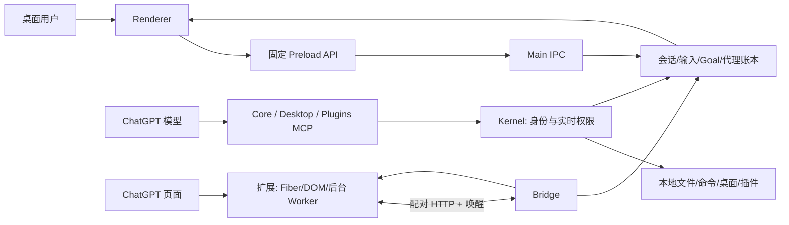

# CoS 3.1.1 代码评估与优化开发方案

审查日期：2026-09-24（Asia/Shanghai）
审查基线：[`MurphyHoops/CoS@641347a`](https://github.com/MurphyHoops/CoS/tree/641347a61a2933112de9671b2bf16b6599b0d55d)
审查对象：`src/`、`extension/`、`native/`、`scripts/`、`test/`、当前 3.x 文档与构建配置。

## 1. 结论与证据范围

CoS 的核心目的不是延长单次 ChatGPT 对话，而是让**本地任务身份和未完成工作长期存在**，把 ChatGPT 对话当作可以替换的执行载体。项目已经有相当完整的本地控制面：会话历史、消息投递队列、精确请求归属、执行 epoch、外部等待、恢复事务、工作代理、权限、浏览器扩展和桌面工具。代码中的多数关键边界有对应测试，基线类型检查、构建与可运行的单元/集成测试通过。

当前最值得先处理的是控制状态的**一致性边界**，而不是增加功能：Block 的成功返回先于其持久写入，设置变更与 Goal/Loop 控制也跨越多个账本；若异步写入、并发保存或进程崩溃交错，内存中可见的状态可能先于已承诺的磁盘状态。其次是首次窗口显示会主动授予浏览器打开能力、损坏状态文件被当作空状态、以及规范文档对浏览器修复 claim 逻辑的描述落后于源码。

本次是**固定提交的源码审查 + 本机测试/构建**。没有连接真实 ChatGPT 账号、长期运行的浏览器扩展、Windows/Linux 设备、打包后的安装包或生产用户数据；以下涉及这些场景的结论均为风险与验证方案，不写成已经复现的线上故障。代码量约为主进程 64,868 行、扩展 21,363 行、渲染层 7,990 行、测试 96,907 行；“全面”在本文指覆盖所有功能域及关键跨层链路，不意味着每一行都经过形式化证明。

### 本次实际检查

| 检查 | 结果 | 证据级别与限制 |
| --- | --- | --- |
| 源码版本 | 从提交号归档取得并与工作树逐文件比对，无差异 | 固定源码；本机 `git` 无提交历史，不能据此证明发布或安装行为 |
| `npm ci` / 依赖审计 | 安装完成，npm 报告 0 个已知漏洞 | 安装时点的 npm 审计结果，不代替代码安全审查 |
| `npm run typecheck` | 通过 | TypeScript 静态检查 |
| 全量常规 Vitest（排除独立关闭套件） | 首轮 181 个测试文件通过、13 个跳过；2 个文件因首次 Electron 二进制并发安装而未启动 | 测试环境冲突，不是断言失败 |
| 重跑上述 2 个文件并加入 `mcp-shutdown` | 3 个文件通过，363 个断言通过、9 个跳过 | 首次安装完成后运行成功 |
| `npm run build` | 主进程、preload、renderer 构建通过 | 构建输出，不代表包内原生模块或实际 GUI 可用；Vite 提示两个动态导入已被静态导入抵消 |
| `npm run verify:notices` | 通过：92 个生产包、7 个插件目录条目、730 个原生源码归档/补丁记录 | 许可证/来源目录检查 |
| `npm run verify:privacy` | 命令显示通过，但只扫描到 **0 commits / 0 tags** | **本次无效**：归档工作树没有 Git 历史；须在真实 clone 的完整历史上重跑 |

## 2. 产品目的、身份与实际运行链路

### 核心身份

| 身份 | 含义 | 主权来源 |
| --- | --- | --- |
| 本地 session / mission | 用户任务、项目、历史和待履行义务的持久身份 | `session/store.ts` 与 `session/long-run.ts` |
| ChatGPT conversation | 当前承载任务的一次前端对话；可由 A 换到 B | 会话绑定与 continuation/rebind 事务 |
| execution epoch | 某一执行载体能修改任务状态的时间区间 | `session/long-run.ts` |
| turn / MCP request | 单次回答与工具请求；HTTP 自身不可信地提供会话归属 | 扩展的原生证据 + `session/correlation.ts` |
| outbox id / browser owner | 一条用户输入和一次浏览器投递 claim | `session/input.ts` 与扩展维护的收据 |
| worker family/run | Prime 拥有的代理任务及其复用/退役状态 | `agents.ts` |

对源码的关键理解：**页面显示、工具执行、投递和完成是不同事实**。一段模型文字不能证明任务完成；插入 composer 不能证明消息被 ChatGPT 接收；浏览器重载不能证明生成恢复；丢失工具响应不能证明本地副作用未发生。仓库将这些事实拆到独立账本中，恢复时优先读取收据和本地状态，再决定是否继续。

### 数据和控制流

1. **新任务**：renderer 保留项目或未归档草稿；`start-input.ts` 将新会话预留及输入写入 `input.ts`；bridge 选定浏览器文档，扩展确认模型/附件/文本并请求 Send 授权；原生用户消息和会话 ID 的证据回来后，outbox 才标记已送达。
2. **工具调用**：MCP listener 验证 secret path、Host/Origin、请求大小；`inbound.ts` 规范化 request id；`kernel.ts` 与扩展上报的 request/conversation 证据关联，检查当前会话、epoch、权限、封锁和代理身份；处理器执行后记录真实结果，再向原请求返回。无精确证据时走受限的 Unattributed 路径。
3. **长等待**：`session_wait` 在 `long-run.ts` 记录义务、wait contract 和 epoch；源 turn 随之失去继续修改该义务的权力；`long-run-runtime.ts` 在本地轮询 GitHub run、进程或计时器，解析后通过既有 outbox/代理复活路径安排一次后续执行。
4. **对话替换**：Compact & Resume 或 Self-Healing 先持久化事务和源会话 fence，选新会话，重建实际工具/进程/消息证据，再把同一本地 session 绑定到新 conversation。`rebind.ts` 同步迁移 Goal、workspace、Long-Run 等投影。

### 关键状态机及“不能重试”的位置

| 状态所有者 | 关键状态/迁移 | 实际语义 |
| --- | --- | --- |
| `session/input.ts` | `queued → browser/tool → sent/decision`，另有 `failed/cancelled` | `queued` 已被本地接受；`browser` 仅是扩展持有投递权；`tool` 是已放入指定工具结果；只有确切原生收据才把浏览器发送判为 `sent`。浏览器授权 Send 后丢 ACK 属于含糊结果，不能自动重新发送。 |
| `session/continuation.ts` | `awaiting-summary → awaiting-chat → claimed → committing → committed`，可 `aborted` | A 的摘要和 B 的打开/换绑属于同一事务。源/目标发送另有 `not-attempted → attempted-unresolved → dispatched-unresolved → sent`；一旦跨过 `dispatched-unresolved`，本地不再能证明消息未发出，必须查证而不能重打。 |
| `session/long-run.ts` | wait 的 `waiting → resolved/failed/cancelled`；work 的 `waiting → owed → dispatching → queued → fulfilled/cancelled` | wait 到期只是外部条件事实；义务到 `owed` 才能竞争一次继续执行；epoch 和原 turn fence 必须在状态变更全过程有效。 |
| `agents.ts` | `invited/active/detached/waking` 占 worker slot；`sleeping` 可复用但不占 slot；`finished/failed` 终止 | 浏览器 tab 消失的 `detached` 仍然是活着的工作，不能误判成可重新派工；报告的持久化和 Prime 收件确认是另一条链。 |
| `bridge.ts` + 扩展 | `worker/resume/revive/stop` 命令与独立 repair claim/ACK | 命令、浏览器文档租约、动作结果收据分离；修复先二次 claim、再查询当前 tab 并执行动作。重载收据只证明页面动作，不证明任务恢复。 |

这些状态机的共同约束是：每个 durable fact 有一个 owner，其他模块只做投影；跨账本转换要能在崩溃后继续收敛。后文的 P1 问题正发生在部分控制转换还没有完全满足这个约束之处。

## 3. 模块清单：输入、职责、产出与失败边界

下表按**责任边界**覆盖源码模块；文件链接均指本文所在仓库。`shared/` 定义跨进程协议和状态类型，主进程是持久状态与副作用的主要所有者。

| 功能域 | 主要文件 | 实际职责与产出 | 必须保持的边界 |
| --- | --- | --- | --- |
| 启动/退出 | [`main/index.ts`](../src/main/index.ts)、`window-lifecycle.ts`、`shutdown.ts` | 单实例锁、按依赖顺序恢复账本、创建安全 Electron 窗口、启动 bridge/MCP/更新检查、分阶段有界退出 | 恢复完成前不接受旧执行者的新副作用；退出先停止接入再冲洗账本 |
| 配置/权限/机密 | [`config.ts`](../src/main/config.ts)、`sandbox.ts`、`secrets.ts`、`setup-profiles.ts`、`shared/capabilities.ts` | 配置校验与队列、当前有效权限、批准根目录路径解析、加密密钥、连接身份切换 | 项目归类不增加文件权限；Read-only 在运行时阻断写能力；密钥不进入 renderer |
| MCP 发布/连接 | `mcp/server.ts`、`surfaces.ts`、`tools*.ts`、`connection.ts`、`tunnel/*` | Core/Desktop/Plugins 三个逻辑接口共享本地 listener；公开隧道、动态工具声明、断线状态和诊断 | schema 可缓存，但每次调用仍执行当前权限检查；endpoint generation 防旧连接结果覆盖新状态 |
| 工具执行核心 | [`mcp/kernel.ts`](../src/main/mcp/kernel.ts)、`inbound.ts`、`call-context.ts`、`tool-declarations.ts` | 统一调用上下文、caller 归属、blocked/superseded/worker/epoch 门禁、结果和录制 | 一次本地副作用与一次真实 outcome 对应；没有确切身份时不能猜选会话 |
| Code mode / 本地编码工具 | `mcp/code-mode-*`、`codex/*`、`rawfs.ts`、`fsops.ts`、`exec.ts`、`search.ts` | QuickJS 仅编排当前 MCP surface；文件读写、补丁、图片、shell、PTY 进程、输出裁剪及命令 custody | JS `exec` 不是 OS shell；权限和路径检查在每个实际处理器；进程归属跨会话替换保留 |
| 会话历史/归属 | [`session/store.ts`](../src/main/session/store.ts)、`recorder.ts`、`correlation.ts`、`shared/session.ts`、`chronology.ts` | session 元数据、事件 JSONL、消息 shard、请求 ID 精确映射、稳定时间顺序、图像/溢出资源 | 录制证据来自 MCP 与页面两路；原生消息不能冒充工具事实，工具事实不能冒充原生完成 |
| 输入/附件/完成 | [`session/input.ts`](../src/main/session/input.ts)、`start-input.ts`、`input-attachments.ts`、`finish.ts`、`task-request.ts` | 可编辑 outbox、附件原件、浏览器/工具注入模式、Astra finish、临时规划器与精确 ACK | durable accept → claim → authorize → 原生 Send → receipt；含原生附件的消息只走浏览器上传 |
| Goal / Loop | [`goal.ts`](../src/main/goal.ts)、`shared/goal*.ts` | 对话目标、全局/单聊开关、回复义务、ChatGPT helper/API/模板决策与续写门禁 | Objective、开关、回复债、决策、Send 各有独立身份；Loop 必须受原任务范围和本 turn 本地 MCP 工作约束 |
| 长任务监督 | [`session/long-run.ts`](../src/main/session/long-run.ts)、`long-run-runtime.ts`、`wait-providers.ts`、`mcp/long-run-tool.ts` | epoch、WorkObligation、WaitContract、GitHub/进程/计时器适配器、Project Runtime 自动完成 | 外部等待由本地监督；旧 turn 在 wait arm 后被 fence；解析 wait 不等于整个任务完成 |
| 替换与自愈 | [`session/continuation.ts`](../src/main/session/continuation.ts)、`self-healing.ts`、`rebind.ts`、`handoff*` | 摘要、A→B 事务、源/目标 Send checkpoint、模糊副作用对账、紧急恢复 | 旧 conversation 即使晚到，也不能重新获得变更任务状态的权力；不盲重放副作用 |
| 代理协作 | [`agents.ts`](../src/main/agents.ts)、`renderer/agent-*` | 每个 Prime family 的 worker slot、派工、休眠/复活、持久 inbox/report、退役隔离 | worker 属于 Prime 任务，不生成第二独立 mission；报告先持久化后投递 |
| 浏览器桥 | [`bridge.ts`](../src/main/bridge.ts)、`browser*.ts`、`session/connectivity.ts` | 扩展配对、状态/事件/收据接口、浏览器命令、tab 选举、修复和静默检测、网络悬挂投影 | 打开/重载必须由具体操作拥有；收据丢失不能简单重做浏览器动作 |
| 浏览器扩展 | `extension/background.js`、`content.js`、`chatgpt-dom.js`、`fiber.js`、`usage.js` | MV3 后台维护 journal/claim/ACK；隔离世界采集 DOM、MAIN 读取原生 turn/Fiber/usage；原生输入/页面动作 | 页面路由 + document/epoch + request/turn 匹配；后台暂停后仍能恢复必要收据 |
| 直接浏览器/原生桌面 | `browser-control.ts`、`mcp/tools-browser.ts`、`computer/*`、`mcp/tools-desktop-*`、`native/*` | 短生命周期浏览器 RPC、截图/DOM/Console/Network；Windows Win32/UIA 或 macOS Swift/AX 截图输入 | 所见 frame/ref、窗口身份、权限和 helper generation 必须在动作前仍匹配；Linux 不暴露原生 Desktop |
| 本地项目与机器完成 | `projects.ts`、`workspace.ts`、[`project-runtime.ts`](../src/main/project-runtime.ts)、`shared/project-runtime.ts` | 项目目录关联、工作路径、可选 `.cos/project.json` 命名验证任务与完成谓词 | profile 是数据和验证契约，不是权限；沙箱和命令能力由 CoS 当前配置决定 |
| 插件 | `plugins/{catalog,installer,manager,exposure,oauth}.ts`、`plugin-refresh.ts` | 本地/远程 MCP 安装及连接、OAuth、工具名冲突与大小上限、ChatGPT connector schema 刷新 | 安装、启用、鉴权、可调用、已发布是不同状态；外部 MCP 权限不受批准根目录的 OS 沙箱约束 |
| UI 与本地边界 | [`preload/index.ts`](../src/preload/index.ts)、`main/ipc.ts`、`renderer/{main,chat,plugins,recovery,usage}.ts` | 固定 IPC 方法、侧栏/对话/设置/恢复状态、历史分页、中文翻译 | renderer 不接触任意主进程方法、密钥或文件系统；UI 乐观状态不能冒充 durable ACK |
| 交付/测试 | `electron-builder.yml`、`scripts/package*.mjs`、`.github/workflows/*`、`test/*` | 多平台资源/原生依赖分发、许可证/隐私检查、Vitest、包/GUI 冒烟 | 源码通过 ≠ 构建通过 ≠ 安装包通过 ≠ 真实 ChatGPT/设备通过 |

### 已实现的强项

- `mcp/server.ts` 将监听绑定到 loopback，并验证路径 token、Host/Origin、请求大小；`preload` 只暴露固定 IPC 方法；文件路径经批准根目录和真实路径检查。
- `input.ts` 对队列先写盘后发布；浏览器投递区分 claim、授权、原生消息和 ACK，明确保留含糊 Send 的状态。
- 请求归属使用扩展采集的 `request_id` 精确证据，`correlation.ts` 坚持首个确证归属，不靠“当前活跃 tab”猜测。
- `long-run.ts`、`continuation.ts` 和 `agents.ts` 明确存储任务债、执行 epoch、恢复/代理身份；源码并非仅靠定时器反复发送“继续”。
- Project Runtime 把项目自有的验证命令作为数据读取，限制 profile 大小、路径和权限；自动完成只允许关闭仍处于 owed 的义务。

## 4. 问题与开发建议（按优先级）

以下“已确认”表示当前源码中直接可见的行为；“竞态风险”表示有具体交错路径，但本次未在真实 app/磁盘故障中复现。优先级按错误后果与任务连续性排序，不按改动行数排序。

### P1-A：设置保存的 `before` 快照在串行队列之外，控制副作用可能依据旧状态

**证据与原因。** [`ipc.ts`](../src/main/ipc.ts#L435) 在调用 `updateConfig` 之前读取 `before = getConfig()`；[`config.ts`](../src/main/config.ts#L663) 才在异步队列内取得真正的 `previous`。随后 Goal 草稿退役、Master Off 清理、插件/浏览器唤醒、登录启动项等多项副作用继续使用队列外的 `before`。当两个设置保存请求相邻到达，第二次写入的真实前态可能与其捕获的 `before` 不同。`afterPublish` 虽收到准确的 `previous`，但只覆盖了部分副作用。

**影响。** 开关显示/磁盘配置和伴随清理可能暂时或永久不一致，尤其是快速 Off→On、权限撤销/恢复和 Goal/worker 停用。此项是**源码可证的陈旧前态风险**，不是已复现的线上漏发。

**最小正确修复。** 将所有依赖旧值的决策移动到 `updateConfig` 同一序列的 `afterPublish(next, previous)`，或让更新返回明确的 transition 对象供单一控制器处理。跨 `config.json`、Goal、代理和 outbox 的停用需要一个操作 ID 与可恢复的意图/完成记录；有效权限应在持久化清理完成前先按更严格状态执行。不要再添并行 watcher 来补偿。

**验收。** 延迟第一次写入，让 Off 与 On 两次保存交错；逐项断言最终 config、Goal overrides、代理 authority、outbox 与 UI 一致。故障注入第二个账本写失败，再启动进程，确保不能把旧 On 当作新授权。

### P1-B：Goal/Loop 的控制账本先改可见内存，再等待持久写入

**证据与原因。** [`goal.ts`](../src/main/goal.ts#L850) 的 `setGoalObjectiveNow`、[`goal.ts`](../src/main/goal.ts#L1090) 的 `setGoalSwitchNow`，以及回复接受/迁移分支，先修改全局 Map，然后 `await writeDurableNow`。同步读者（例如 `goalArmedFor`、bridge eligibility）在等待期间可以读到尚未承诺的值。另有 `clearAllGoalSwitches`、`clearGoalObjective`、普通 rebind 投影使用异步 `writeDurableSoon`；[`rebind.ts`](../src/main/session/rebind.ts#L22) 在会话元数据已换绑后迁移这些控制状态。现有串行器只串行同一种写入，未形成跨账本语义事务。仓库 `AGENTS.md` §21 也标记了这一方向。

**影响。** 磁盘故障、进程崩溃或并发控制操作下，自动续写判断可能依据尚未持久化或最终回滚的 Goal 状态；A→B 迁移时可能出现 session 已属于 B，而 Goal 仍留在 A 的恢复窗口。未在本次测试中复现具体错误发送，故障形式为**竞态风险**。

**开发方案。** 对单账本操作，以不可见候选快照先写盘，成功后一次性发布内存；所有清除/迁移入口统一经过 owner 串行器。对 A→B 与 Master Off 建立可重放的事务记录：先 fence 旧执行者，再持久迁移/清理各账本，最后标记事务完成；重启只向前收敛，不能用旧状态回滚已经提交的新操作。保持目前“模糊副作用先对账”的原则。

**验收。** 写入前暂停、同时查询 Goal eligibility；成功前必须只见旧状态。注入写失败、并发 Off/On、A→B 中途退出及恢复，确认没有重复续写、旧 conversation 重新获得权限或目标丢失。

### P1-C：Block 已返回成功，但用户的封锁仍在延迟写入队列

**证据与原因。** [`blocked-chats.ts`](../src/main/session/blocked-chats.ts#L128) 的 `setChatBlocked` 立即修改内存并调用 `writeDurableSoon`；[`durable.ts`](../src/main/durable.ts#L23) 的普通延迟为 300 ms；[`ipc.ts`](../src/main/ipc.ts#L929) 的 `sessions:block` 随后返回当前封锁列表，没有等待持久写入。现有 [`blocked-chats.test.ts`](../test/blocked-chats.test.ts#L64) 在模拟重启前主动调用 `flushDurable()`，因此没有覆盖“IPC 成功返回后马上退出”的窗口。删除会话也在释放 Block 与删除会话文件之间跨账本，若释放尚未写入而会话已删除，重启后可能留下无法通过该行 UI 释放的封锁。

**影响。** Block 原本用于拒绝失控对话的本地工具。崩溃窗口内成功提示可能在重启后失效；反向的 Release 也可能重启后又被封锁。这是**已确认的源码时序缺口**，不是对真实崩溃概率的估算。

**开发方案。** 提供串行的 `setChatBlockedNow`。Block 可先在内存中立刻收紧权限以挡住并发工具，但必须在写盘成功后才向 UI 返回成功；写盘失败时继续保持保守封锁并呈现未持久化错误/重试。Release 先持久化解除，再放开实时门禁。删除受封锁会话时，把解除与删除做成可恢复的有序事务，防止无 UI 入口的孤儿封锁。避免为此创建第二套 block 状态。

**验收。** 故障注入 `writeDurableNow` 失败与写入中进程退出，测试 Block/Release 两方向的重启结果；并验证 Block 在写入等待期间已阻断精确归属的工具调用。删除会话的中途退出测试需证明既不放行原失控对话，也不遗留不可解除的封锁。

### P2-D：第一次窗口显示主动允许打开浏览器进行模型发现

**证据。** [`index.ts`](../src/main/index.ts#L138) 在窗口 `show` 且模型目录 unknown 时调用 `startChatModelDiscovery(true)`；[`chat-models.ts`](../src/main/chat-models.ts#L64) 会向浏览器唤醒逻辑传递 `allowOpen`。这是实际代码行为，且 `AGENTS.md` §21 已列为缺口。

**影响。** 仅打开桌面应用就可能产生新的浏览器文档；它与“一个明确操作拥有一次打开权”的设计相悖，也可能干扰个人浏览器会话。

**修复与验收。** 窗口显示只读取已保存目录或执行 `allowOpen=false` 的被动观察；用户显式 Refresh 或某条待发送输入才拥有打开权。覆盖冷启动目录未知、窗口重复 show、浏览器已存在、没有浏览器及显式 Refresh 的 tab 数与 claim 次数。

### P2-E：关键状态 JSON 读坏时被当作空状态，任务债可能消失

**证据。** [`durable.ts`](../src/main/durable.ts#L51) 将所有读取/JSON 解析错误转成 `null`；[`index.ts`](../src/main/index.ts#L315) 等启动路径据此调用 `restoreGoal*`、`restoreLongRunState`、`restoreSwarm`、`restoreContinuations`。这些 restore 对 null 通常清空或保留空账本。注释明确选择“状态损坏不阻止启动”，但这不等于任务连续性得到保证。

**影响。** 对权限撤销、待办、wait、worker 或 continuation 这样的控制账本，损坏文件可能表现为“没有欠账”，而不是可见的恢复异常。此风险需要通过损坏文件故障注入验证实际用户表现。

**修复与验收。** 按状态类别区分：展示缓存可降级；控制账本遇解析/校验失败应隔离原文件、尝试最后一个已校验备份，并把该任务标为需人工核对的暂停状态。不要自动重发可能执行过的变更。补充每种关键账本的截断 JSON、非法 schema、备份恢复和旧执行者拒绝测试。另明确“durable”保证是应用崩溃/重启，还是包括断电；当前 temp+rename 没有文件及目录 `fsync`，不能宣称断电级持久性。

### P2-F（审计纠正）：当前基线不存在 Recording Off 产品状态

后续对真实 `641347a` Git 基线复核发现，本项原始判断不成立。`config.ts` 的 sessions schema 虽继续读取旧配置中的 `record` / `retainDays` 字段以保持 wire compatibility，但在配置边界统一归一化为 `record: true`、`retainDays: 0`；默认配置也是同一值。`test/config.test.ts` 已覆盖旧 `record:false` 配置保存与重载后仍被规范化为 Recording On。

因此不存在“用户关闭 Recording 后，旧 per-chat Goal override 仍被执行”的当前产品路径，也不应为这个不可达状态再增加 Goal 门禁。若未来重新引入 Recording Off，需要先重新设计 Goal/Loop、历史证据和恢复语义，再开放该设置。

### P2-G：审查规范与现有实现有漂移

**证据。** `AGENTS.md` §21 仍说“其他浏览器修复原因在 tab 查询/动作前没有最终 claim”；当前 [`bridge.ts`](../src/main/bridge.ts#L8644) 对所有准备执行的修复都下发 `requiresClaim: true`，[`extension/background.js`](../extension/background.js#L2565) 对每项先调用 `/repairs/claim`，随后重查 tab 再执行动作。`AGENTS.md` 的 ownership map 提到不存在的 `session/retention.ts`；`mcp/surfaces.ts` 文件注释仍称“两种 surface”，实际有 Core、Desktop、Plugins 三种。

**影响。** 新开发者可能围绕已修的边界重复设计，或按错误文件图追踪问题。

**修复与验收。** 更新现行规范的缺口列表和文件图，链接确切源码/协议测试；将“意图”“当前源码”“尚未验证的 live 行为”分开。文档修改不应倒推删除当前 claim 测试。另为 `AGENTS.md` 文件路径增加轻量存在性检查即可，无须另建文档生成框架。

### P3-H：高耦合文件提高变更与实机验证成本

**证据。** `bridge.ts` 10,335 行，`extension/content.js` 11,465 行，`agents.ts` 4,436 行，`renderer/chat.ts` 4,195 行。构建时 `input-attachments.ts` 和 `input.ts` 的动态导入被静态导入抵消；主进程单 chunk 约 2.08 MB。这些数字本身不证明性能故障，但意味着跨协议修改的审查面很大。

**开发建议。** 只在修 P1/P2 所触及的 owner 边界抽出纯判定函数或状态转换函数，并保持现有对外协议；优先删除重复状态和分散的时间器。先量测启动时间、bridge 维护耗时、峰值内存和 Electron 包大小，再决定是否为性能而拆 chunk。不要为了文件变短而拆出相互循环调用的包装层。

### 需持续观察的外部风险（本次未判为代码缺陷）

- 扩展依赖 ChatGPT 的 DOM、Fiber 与网络事件形态；provider 页面变化可能使归属、模型选择或发送收据退化。应保留失配时的显式失败和人工重试，建立版本化页面夹具与真实账号的受控冒烟，而不是靠猜测回退。
- 扩展声明了广泛的 `http://*/*`、`https://*/*` host permission，这是直接浏览器控制功能的高权限范围。需要在发布说明、能力开关及运行时路由检查中持续清楚呈现，并验证关闭控制权限后动作立即拒绝。
- 本机运行在 macOS，Windows UIA/Win32、Linux AppImage/DEB、macOS 实际屏幕录制/辅助功能授权、外部插件 OAuth 与真实 ChatGPT 连接均未由本次通过的 Vitest/构建证明。

## 5. 建议的实施顺序与交付门槛

| 阶段 | 目标与具体改动 | 交付证据 |
| --- | --- | --- |
| 1：控制事务 | 修 P1-A、P1-B、P1-C：Block 的持久 ACK；设置 side effect 用队列内前态；Goal 候选快照先写后发布；统一清理与 rebind 的序列/事务恢复。P2-F 经真实基线复核后撤销为误报。 | 并发 Off/On、Block/Release/删除、磁盘失败、A→B 中断的故障注入；相关 `blocked-chats`、`goal`、`continuation`、`self-healing`、`ipc` 测试和全量 `verify` |
| 2：恢复质量 | 修 P2-E：关键状态损坏分类、备份/暂停、明确可恢复与不可重放结果 | 对每种关键账本的损坏/重启测试；用户界面显示明确的恢复状态；无自动重复 mutation |
| 3：浏览器打开纪律 | 修 P2-D，并检查新 chat、repair、model refresh 共用的选举/打开权 | 扩展 + bridge 双端测试；实机观察重复 show、关闭 tab、MV3 暂停及丢 ACK；无额外 tab |
| 4：规范与发布验证 | 修 P2-G；在真实 Git clone 做隐私历史检查；按平台跑包内/安装后 smoke | 文档路径检查、完整历史 `verify:privacy`、macOS/Windows/Linux CI 包/GUI 记录 |
| 5：按数据决定精简 | 在前几阶段改动触及的超大模块提取稳定 owner 边界，删除重复分支；仅在量测有收益时调整构建 chunk | 与基线比较维护耗时/启动/内存/包体；协议及行为回归测试不退化 |

完成标准应按层分开报告：**源码修正、自动测试、构建、打包、安装后运行、真实浏览器/设备**。某一层通过不替代下一层。每项修改须记录第一处错误状态转换、相邻负例、实际执行的命令和未覆盖的平台；拒绝用“测试全绿”推断丢 ACK、断电或 provider 改版场景已经验证。

## 6. 后续研究入口

若要继续逐条修复，建议每次沿一个真实身份追踪：`session id → conversation id → request/turn id → epoch → outbox/command id → receipt`。对应入口为 `test/goal.test.ts`、`test/continuation.test.ts`、`test/self-healing.test.ts`、`test/long-run*.test.ts`、`test/session-input*.test.ts`、`test/bridge.test.ts`、`test/extension.test.ts`、`test/mcp.test.ts`、`test/renderer-state.test.ts`。将其作为已有契约，新增测试只覆盖真正缺失的竞态/失败场景。

本报告没有修改产品代码、测试或运行时状态；工作目录保留固定提交的源文件及本文。由于直接 Git fetch 遇到 TLS 连接失败，源码通过 GitHub 提交号归档取得，`origin` 已指向项目仓库，但本地 `.git` 无提交历史；历史隐私检查必须在日后可用的完整 clone 上重做。
