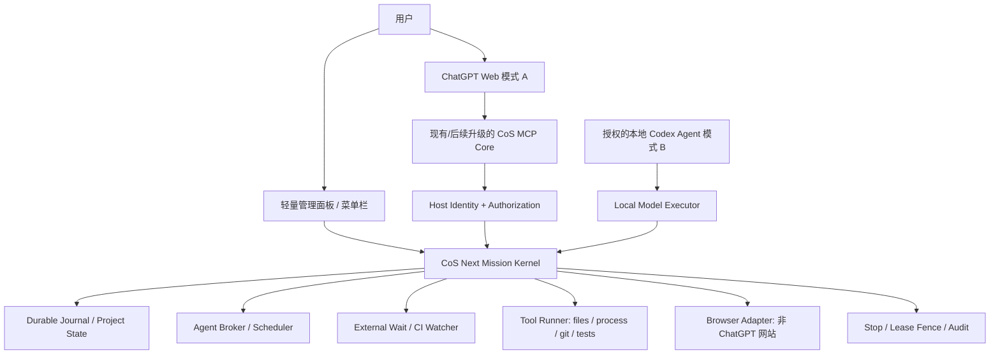

# CoS Next 4.0：总体架构与实施蓝图（设计冻结候选 v1.0）

日期：2026-10-08｜状态：**DESIGN / NO PRODUCTION CUTOVER**｜分支：`next/v4-chatgpt-first-design`
基线：CoS 本机 3.1.16；Next HEAD 在本次设计前为 `59ea305`；远端 main `aa50d8d57d76`（2026-10-08 核对）。
此文是设计与后续施工合同，不代表已完成身份、Agent 或 Web 自主续跑的生产修复。

## 0. 最终目标与不可退让条件

1. 用户日常使用 **ChatGPT 网页 + 已有 CoS MCP**，无需额外聊天界面；可选本地轻量管理面板做权限、任务治理、救援和设置。
2. **多 Agent、自动续跑、项目管理都是一等核心功能**；不因为 Chrome Companion 无法访问，就降级成只会运行 shell 的 MCP。
3. 默认不要求另买 API Token：模式 A 完全在 ChatGPT 网页端推理；模式 B 仅在符合资格并得到用户 OAuth 许可时使用官方 Sign in with ChatGPT / Codex app-server。订阅并非无限额；不允许模拟网页发送、偷取 Cookie 或绕过配额。
4. 保留旧 CoS 3.1.16 以及它的 Companion、项目、密钥、任务数据、三个既有 Tunnel 和历史仓库工作树。**设计阶段不切断运行实例；未来切换必须停机窗口、可回滚、用户知晓。**
5. 正确性先于无人值守：任何外部效果状态不明，不能把“命令已发”判成“任务已完成”；任何身份无法验证，不能偷拿另一个任务的控制权。
6. 优先**复用已经写好且经过测试的 CoS 任务/会话/Agent/外部等待/项目运行内核**，做边界重构；不从零造另一个系统。
7. Chrome/Edge Companion 不能继续是新内核身份、持久化、项目状态或本地执行的唯一根；浏览器自动化仅作为独立可插拔能力。

## 1. 事实、未证实事项、主要技术决策

| 事项 | 事实或成熟度 | 设计要求 |
| --- | --- | --- |
| 本机 Core MCP | 实测命令执行正常，常返回 `Unattributed` | 保留工具执行，新增会话来源适配与任务授权 |
| 身份敏感工具 | 实测 `agents/status` → `WORKER_IDENTITY_LOST`；`session_wait` / `project_runtime` 拒绝 | 不删除拒绝保护，必须先证明 Caller + Lease |
| 官方 ChatGPT 元数据 | 文档规定 `_meta["openai/session"]`、`["openai/subject"]`；本机 MCP SDK 对合成请求 27 项新测试覆盖 | 真实 ChatGPT → 本机 CoS 的 G1b 尚未通过 |
| 原会话身份 | CoS v3 借网页扩展将 `x-request-id` 关联内部 conversation UUID | 新版不假定 `openai/session` = URL UUID |
| 已有三条 Tunnel | 本机三个运行客户端健康；Screenshot 中新填 Tunnel 与本机不同 | 优先复用 Core；**相同 tunnel_id 不可两实例抢占** |
| Plugins MCP Relay | `src/main/mcp/tools-plugins.ts` 转发 `name/arguments`，未传 ChatGPT 原始 `_meta` | 不能指望直接添加下游插件完成 G1b；须在入口处理/显式上下文传播 |
| Agent 基础逻辑 | CoS v3 工作线程、消息、持久队列、恢复能力已有大量测试 | 复用协调/事务逻辑；更换“Worker = 浏览器标签页”的单一假设 |
| Web 主动推理 | 普通 MCP 是由 ChatGPT 主动调用；未证明服务端可重启网页模型回合 | 明确不把本地唤醒算成网页模型接受 |
| 本地推理通道 | 官方许可 OSS/符合资格客户端用 ChatGPT 计划登录、Codex app-server | B 具备可研究/实现路径，仍需用户资格和端到端验收 |
| 浏览器能力 | v3 后台标签页 DOM/Network 依赖 Companion；Mac Accessibility 尚未授予 | 非 ChatGPT 浏览器首选官方授权 DevTools MCP/CDP 隔离上下文；不驱动 ChatGPT 网页绕额度 |

**设计决策 D-01：** 采用 A/B 双推理通道、单一 Mission Kernel、多前端；**B 承担真正自治推理，A 保留原生网页订阅交互**。不再承诺 A 有无人值守网页续轮能力。

**设计决策 D-02：** ChatGPT host metadata 仅是会话关联信号。MCP 传输/Tunnel 私有 URL 不是已验证最终用户身份；用户级权限必须有受信 Principal + 本地批准的 Mission Lease。

**设计决策 D-03：** 现有 CoS Core 通道未来可通过兼容升级来承载新工具；但想在原进程不变、原 Tunnel 不断的同时让新 Next 进程直接接管该 ID，在产品上不可行。需要选择独立测试连接或预约受控切换。

## 2. 模块与进程架构

### 2.1 逻辑分层（只维护一套执行权威）
- **Host Adapter**：MCP Web，SIWC 本地 Agent，未来其他宿主；统一生成“已知/未知身份”的 `CallerEvidence`，禁止透传模型自写身份作为证据。
- **Identity + Permission Gate**：校验受信主体、来源命名空间、绑定的 Mission、执行租约、能力位和项目根目录；拒绝/记录任何未授权操作。
- **Mission Kernel**：任务状态机、持久责任、计划/证据、完成判据、Stop/暂停/恢复、单一当前 Epoch；避免“旧 Goal 与 Long Run 两个权威”再次出现。
- **Agent Broker**：Prime/Worker 逻辑 ID、角色权限、队列、预算、重试、交付确认；前端执行器是可插拔的，不再绑定某个 Chrome Tab。
- **Model Executor**：A=交互式宿主发起的回合；B=获得正式 OAuth 权限的独立 Codex app-server 线程；未来其他合法适配器需要独立审核。
- **External Work Executor**：项目文件、终端、GitHub CI、进程、浏览器、桌面；对每种真实副作用单独定义“请求、承认、确认、未知”的语义。
- **Observability + Admin**：原生轻面板仅管理会话/项目/权限/紧急 Stop/排障；不再要求用户在 CoS GUI 内聊天。

### 2.2 保留 v3 的核心代码与隔离新模块
| 保留/改造点 | 现存模块 | 目标 |
| --- | --- | --- |
| Core MCP 入口 | `src/main/mcp/server.ts`、`kernel.ts`、`inbound.ts` | 从 `ServerContext.mcpReq._meta` 提取来源证据；不修改其他工具的入参 |
| 旧网页确证（仅兼容） | `src/main/session/correlation.ts`、`recorder.ts` | 只作 v3 legacy adapter；不得把旧 UUID 强行映射新 host session |
| Agent broker | `src/main/agents.ts` / `agents-recovery.ts` | 派发/恢复逻辑保持，抽象 WorkerExecutor / DeliveryReceipt |
| 外部等待 | `src/main/session/long-run.ts`、`long-run-runtime.ts`、`wait-providers.ts` | 本地 watcher 保留；重新区分本地完成/模型续轮 |
| 项目完成 | `src/main/project-runtime.ts`、`mcp/project-runtime-tool.ts` | 继续 test-then-check + 项目完成谓词，严格 scope |
| 审计和存储 | `src/main/session/store.ts`、`mcp/call-context.ts` | 增加 Next schema 与 HostBinding 适配，旧数据只读 |
| 外部插件 | `src/main/plugins/manager.ts`、`mcp/tools-plugins.ts` | 插件下游不可暗自取得上游特权；必要时封装验证过的 caller context |
| 原生桌面 | `src/main/mcp/tools-desktop-macos.ts` | 权限明确、独立 MCP 工具、敏感窗口默认不驱动 |
| 初始化/升级 | `src/main/index.ts`、`tunnel/index.ts` | Next 独立 bundle ID/用户数据/端口/密钥，旧版本不覆盖 |

建议新增抽象：`src/main/next/identity/`、`mission/`、`executor/`、`delivery/`、`auth/`、`migration/`、`observability/`。不移动旧模块直到接口和回归测试证明可安全替换。

## 3. 身份与授权（首个阻断 Gate）

### 3.1 六类不可混用的标识
1. `request_id`：单次工具请求/幂等关联，用于找到原来的请求记录，不代表 chat。
2. `mcp_transport_session_id`：传输协商的会话标识，可能无、轮换或受重连影响。
3. `host_session`：官方 `openai/session` 匿名对话标识，仅作为同一 ChatGPT 对话调用的相关性证据。
4. `account_principal`：经独立验证的用户/账户/本机批准权威；`openai/subject` **不自动代替已认证 principal**。
5. `mission_id`：CoS 自己的 UUID，与 host session 生命周期分离。
6. `agent_id` + `execution_epoch`：CoS Worker 和当前有效租约代次，不能仅靠聊天名字识别。

### 3.2 两级认证
- **连接级**：CoS 当前本地 MCP 来自既有受保护 Tunnel，首先确定是否能被其他控制主体重放/共用；在未证实前使用可信连接边界和本机批准，而不依赖未签名 `_meta` 授权写操作。
- **Mission 级**：受信本机操作者批准“哪个 ChatGPT host session 可以读/写哪个项目和哪些 Worker”；有限权限并默认到期。Agent 只能继承其 Prime 签发的最小委托范围。
- **会话绑定**：存储带域 HMAC 指纹，而非原文会话 ID；从本地安全密钥导出持久比对指纹，支持密钥轮换与双读过渡。最初 27 项测试使用进程级 HMAC **仅作诊断**，不适用于重启后的生产绑定。
- **不具备认证时**：允许可独立限定的低风险只读/显式临时项目工具；`agents/message`、`resume`、`stop others`、跨 Mission 工具必须 fail closed 或请求本地明确批准。

### 3.3 Authorize 判定顺序
1. 服务端真实收到的 `ctx.mcpReq._meta`/请求上下文经类型、长度和来源检查。
2. 验证可信接入与 `principal/account/workspace`；无法验证则 `UNTRUSTED_CALLER`。
3. 计算 `host_binding_key = HMAC(local_key, host_namespace | principal | host_session)`。
4. 由服务端绑定表查 `mission_id + lease_id`；任意传入的 `mission_id` 只能是查找条件，不能是授权凭证。
5. 复核 `project_scope/capabilities/epoch/expiry/revoked`，锁定当前权限快照。
6. Mutation 进入 Durable Intent Journal；所有异步阶段再次检查 epoch；失败返回分类错误，不猜测身份。

### 3.4 不能省略的危险场景
- 两个 ChatGPT 对话持有同一用户 `openai/subject`，也不能互相控制未授权的 Mission。
- 旧 Worker、重复 tool call、重放 `_meta`、重启后旧 nonce/lease、撤权后的延迟 ACK 必须全部拒绝。
- Stop 是跨执行器的更高优先级本地权威；正在运行的危险命令应可取消或设置补偿，不能再派发新写入。
- 损坏或缺失会话证据时优先显式恢复审批；禁止用网页前台标签页、近期命令、时间邻近等启发式匹配。
- 用户/项目解绑不能清除审计或默认为“任务完成”；要持久记录拒绝原因和剩余义务。

## 4. Mission / Project / Agent 状态机

### 4.1 Mission 主状态（推荐）
`DRAFT → READY → RUNNING → WAITING_EXTERNAL → CONTINUATION_OWED → RUNNING → COMPLETED`；
并行可进入 `WAITING_MODEL`、`NEEDS_USER`、`PAUSED`、`FAILED`、`STOPPED`。
- `COMPLETED` 仅当所有 mandatory obligations 有证据/被显式豁免且机器检查通过。
- `CONTINUATION_OWED` 只表示后续模型工作已形成“待完成责任”；不能标记为“模型已收到”。
- `STOPPED` 永久围栏旧 Epoch；恢复必须新审批/新的 Epoch。
- `WAITING_MODEL` 表示 B 引擎配额/授权/可用性等待；A 的 ChatGPT 网页需要新的宿主发起调用时标 `NEEDS_USER_OR_HOST`，不能伪造续轮成功。

### 4.2 Agent 主状态
`CREATED → QUEUED → LEASED → RUNNING → REPORT_OWED → DELIVERED → SLEEPING/FINISHED`；
异常状态 `WAITING_PROVIDER`、`DETACHED`、`RECOVERY_NEEDED`、`FAILED`、`CANCELLED`。
- Prime 和 Worker 由 Kernel 分配稳定逻辑 ID；Web 模式 A 不把“打开了标签页”当作创建了可执行 Agent。
- 每个 Worker 的 `executor_kind` = `interactive_web`、`codex_local`（未来适配器单列）。
- `interactive_web`：可以管理任务/消息/待领取清单，但 Web 推理只有宿主主动发起时前进；不可承诺后台召回网页对话。
- `codex_local`：B 通过 `thread/start` / `thread/resume` 运行模型，需运行时用户资格、模型和额度确认；与 ChatGPT 网页历史无共享假设。
- 消息有 `message_id + sender/receiver + epoch + delivery_state`；`DELIVERED` 要求目标执行器/模型会话确认，不以 HTTP 200 或打开网页为证据。

### 4.3 项目管理
**Project（长期）→ Missions（目标）→ Plans（计划）→ Obligations（责任）→ Evidence（证据）→ Completion Contract**。
- 项目 canonical root 由真实路径 canonicalize/权限确定，不允许未经授权的路径切换、符号链接逃逸、Git 工作树串用。
- 每个项目定义 `.cos/project.json` 的测试、资源约束、完成谓词和交付物；缺配置不伪造检查。
- GitHub issue/PR/branch、CI run ID、resulting-main SHA 都作为 evidence，不能单凭 Worker 文字“通过”闭环。
- 对 UEOT Lean 任务：强制证明目标、`sorry/admit/axiom` 卫生、import/编译、特定 theorem 声明、CI、resulting-main 和 ledger 一致。
- 对 UEOT-GI 实验：强制数据 provenance、基线、统计 gate、可复现种子、非劣界和 HOLD/INCONCLUSIVE 区分。
- 对 CoS 自身：需要本地旧版不受影响、构建类型检查、功能回归、包签名/平台 CI、rollback smoke。

## 5. 可靠性与幂等：严格区分外部事实

### 5.1 Journal-first 执行协议
1. `intent_recorded`：保存工具参数摘要、操作者授权、执行 epoch、幂等键和影响范围。
2. `admitted`：在当前权限和范围内占用执行 lease。
3. `dispatched`：发送到工具/本地子进程/服务。
4. `effect_observed`：外部证据（进程退出状态、Git commit SHA、CI run 完成结果）。
5. `result_published`：模型/前端接到工具结果（如能证明）。
6. `task_committed`：完成谓词复核成功且 Journal 事务落盘。

**特别规定**：网络断开且副作用未知时进入 `UNKNOWN_EFFECT`，需按照 Git/文件哈希/进程清单等证据 reconcile；严禁重新发一条可能重复执行的写入。系统目标是**禁止重复派发未知写操作 + 最终核对**，不虚称跨 GitHub/浏览器和模型的数学 exactly-once。

### 5.2 CI 与长任务续跑
- 外部 watcher 在 CoS 本地持续检测 GitHub Actions / 子进程 / 约定外部条件，采取退避、超时、限流保护。
- 事件 `WAIT_RESOLVED` 生成一次 `CONTINUATION_OWED`，记录 `obligation_id`、前置 request、epoch 和证据。
- A：当用户/ChatGPT 主动调用任务工具时读取 backlog，恢复工作；否则保留待领取状态并可本地通知，但**不自启 ChatGPT 网页推理**。
- B：本地 Codex Executor 领取任务，执行业务模型回合，确认 `turn/completed + status=completed` 后才提交报告；失败/中断保留待履行 obligation。
- 同一 CI 完成事件、进程退出和 App 重启重复通知必须只映射到一个有效 obligation；最终副作用核查独立进行。

### 5.3 故障策略
| 故障 | 应有行为 |
| --- | --- |
| CoS 进程崩溃 / Mac 重启 | 重建 Journal + process/CI reconciliation；不自动重放未知写入 |
| ChatGPT MCP 断开/平台 429/503 | 本地任务仍保存；有限重连+有界退避；不请求更多身份或账户绕限 |
| 模型额度耗尽 | B 进入 `WAITING_MODEL`，展示准确额度/重试信息；A 仍按网页本身规则工作 |
| Browser Companion 失效 | Core/Kernel/本地 B 完全不受影响；旧 v3 浏览器功能标记降级 |
| Mac Accessibility 未授权 | 只拒绝桌面控制，不能把项目执行系统一起阻塞 |
| 一个 Worker 挂死/报告丢失 | 保留 obligation + lease fencing，可重派新的逻辑执行器但先证明旧执行器不再有写权限 |
| Stop 与 commit 并发 | 以 epoch/事务比较交换仲裁；无新副作用进入旧 lease |
| Tunnel ID 竞争/配置刷新失败 | 不双占同一 Tunnel；恢复旧进程与旧连接，不强行新建大量 MCP |

## 6. CoS MCP 与已有三条 Tunnel 的复用设计

### 6.1 默认主通道
- 用户已有 `Core / Desktop / Plugins` 三套 MCP 连接。**Next 先保留 Core 的接口名和工具 ABI**，新工具尽量走该 Core 通道，避免再创建一个大量新插件。
- `Desktop` 仍限授权桌面能力；`Plugins` 仍当外部插件代理，不把上游 host metadata 裸透传成下游用户身份。
- 新工具加入后，需要遵守 ChatGPT 的 **插件工具目录刷新**流程；不能假设当前客户端自动发现代码新增工具。
- 现有截图曾出现“应用配置速率限制”，并有选中的 Tunnel ID 未匹配本地运行客户端。该问题与 Tool Runtime 的功能性是不同 Gate；不要把重建 MCP 当默认修复动作。

### 6.2 重要部署限制
**单个旧 Core Tunnel 与旧 CoS 正在配对服务。** 可以复用 **已有身份/连接**，但不能既保证旧 Core 进程永不受影响，又让另一台独立 Next 进程同时接管同一 Tunnel ID。必须选择：
- **阶段开发/合成验证**：Next 完全独立，旧 Core 保持在线，不修改已安装系统；
- **优先 G1b 的受控过渡方案**：仅在另行批准的维护窗口备份配置/校验回滚包，部署“元数据诊断只读工具”的受测兼容构建，重启/刷新**原 Core 连接**，做一次最小真实调用后立即恢复旧版；不改既有 Mission 权限；此方案要在变更前明确暂停或恢复窗口；
- **限流恢复后的独立 Dev MCP/Tunnel**：如果用户/平台允许再创建测试连接，则在正式 Core 不变的前提下完成 G1b；这是更彻底隔离但额外配置的选择；
- **绝不选择**：在同一 `tunnel_id` 下并发启动两个活跃 Tunnel Client、把现有 CoS 进程监听端口偷偷代理给 Next、或在未经授权时替换旧 App。

### 6.3 G1b 与 G2b 绝不能混淆
- G1b：真实 ChatGPT 工具调用是否携带稳定 `openai/session`；分别在两个对话中测 2+1+1 次；缺失要显示概率/调用路径。
- G2b：相关性 ID 配合可验证主体、本机授权、租约 epoch 才能操作项目/Agent。匿名 Session 没有权限本身；即使 G1b PASS，G2b 仍可能 BLOCK。
- 目前的 `scripts/next/identity-probe.mjs` 是安全、只读、独立的本地实验，不是已部署 production 身份认证模块。

## 7. 两种模型运行模式的精确语义

### 模式 A：ChatGPT Web + MCP（默认）
- 用户在网页 ChatGPT 中提出请求；ChatGPT 决定何时调用 CoS Core；工具完成后模型正常回复。
- 本地 CoS 可以执行长过程、代理协调、存储责任和通知。
- “多 Agent”在 A 下可创建逻辑 Worker 队列/计划/异步任务，但**不能靠 MCP 自动新建/唤醒网页 ChatGPT Agent 对话**。没有合法 host turn API 前，交付对象可以是已激活 ChatGPT 会话和待领取任务。
- 默认需要用户可控动作才能恢复新模型回合；原生网页对话历史和原生 UI 仍由 ChatGPT 管理。

### 模式 B：授权本地 Codex Agent（可选、自治）
- 合规 OSS 客户端采用 SIWC 动态客户端注册：保存稳定 `ext_agent_host_id`、OAuth PKCE/state/nonce、签名与 issuer/audience 验证、scope `chatgpt.tokens.use.direct`。
- 凭证存 macOS Keychain/加密存储；按官方指导刷新 tokens；不能在日志/模型上下文/仓库中暴露 access/refresh tokens。
- Codex app-server 使用经授权的 ChatGPT 计划访问令牌；应用保存自己的 `thread_id` /消息状态，`thread/start → turn/start → turn/completed`。遇模型能力或配额拒绝时等待，而不是转付费 API。
- **B 的上下文不等于 A 的 ChatGPT 网页历史**；唯一可迁移的是用户明确授权的任务摘要、代码/项目状态、可复核证据，不可暗取网页隐藏历史。
- 同一任务允许 A ↔ B 的**任务控制权迁移**，但采用新 epoch、明确 OwnerTransfer，绝不同时放两个可写 Agent 实例。
- 官方预览限制：支持的模型/工具/参数有限；使用 `store:false`、`stream:true`，不得假定远端持久会话存储、Hosted File Search 等可用。

### 可计费 API（严格独立选项）
- 保留以后显式设置的付费 API Provider，但在 v4 MVP 中 **默认关闭**，不会在 B 使用额度耗尽后自动切换。
- 区分“另外按量计费=0”和“ChatGPT 模型使用无限”，不得营销为无额度限制；监控 429/额度/账户模型资格。

## 8. Browser / Desktop 控制替代

- **非 ChatGPT 网站**：允许基于授权的 Chrome DevTools MCP 或经过管理的 Playwright/CDP 专用浏览器上下文；采用 per-origin allowlist、只读/写分级、tab ownership/cleanup、截图/网络权限审计。
- **正在使用的用户 Chrome Profile**：严禁静默开启全局调试端口、读取 Cookie、抓取 ChatGPT 内部模型接口；对浏览器标签页/敏感站点默认禁用跨 tab 控制。
- **Mac 桌面**：保留 CoS Native Desktop 工具和 Accessibility/Screen Recording 的 OS 授权流程；不把权限缺失当做 Core MCP 出错。
- **旧 Chrome Companion**：v3 继续维护；新 Next 仅保留有明确合法用例的兼容 adapter，非核心依赖。完全删除前必须逐项对照 v3 能力表并通过无插件 G5。

## 9. 运维、安全与数据隔离

- Next 分配独立 `bundle identifier`、`userData`、Keychain service、SQLite/日记目录、锁文件、socket、日志、自动更新频道、系统启动项、Crash dump、Telemetry consent；**不得复制 v3 密钥或 Token 作为捷径**。
- 每个任务维护其 credential/project scope、授权审计与最小可回放事件；机密值永不写入工具正文、Git 日志、测试文件或对话摘要。
- 原 v3 JSON/Durable 任务存储为遗留读源，第一次迁移仅做**备份 + 只读 inventory + 完整性检查 + 用户选择 + 新增 UUID 映射**；旧 Store 不写入、不移动。两个版本对共享代码库/同一项目的写权限必须互斥。
- Next 建议新增独立 SQLite WAL 任务目录索引、bind/lease/transaction journal（具体方案见接口规格）；旧 Agent 内核 journal 在迁移期间保留原格式，通过一层 adapter 转换，不同时维护两个“已完成”权威。
- 默认本地采集：服务版本、检测到的客户端类别、功能/权限/队列/状态转移、匿名统计。只有经明确同意才收集敏感诊断；任何 `_meta` raw ID 不进入持久日志。

## 10. 关键性能与正确性指标

| 指标 | 发布验收要求 |
| --- | --- |
| 未授权跨任务写入 | **0**；拒绝前无副作用 |
| Stop 后新写派发 | **0**（同 epoch 被立即拒绝，已执行副作用注明不可撤销性） |
| Unknown effect 自动重复派发 | **0**；必须 reconcile |
| CoS 旧版数据/安装受损 | **0**；side-by-side 验证 |
| 无插件 Core 基本工具成功率 | 在受控无故障测试中 **≥99%**；配额/平台 outage 独立统计 |
| 本地外部任务完成/重复消息 | 对同一外部事件至多一个有效 continuation obligation |
| 会话身份归属 | G1b 真实验证；缺失时 fail closed，不得以测试模拟数据代替 |
| Agent/项目/长期等待完整性 | 并发 2 聊天+2 项目+多个 Worker+重启/Stop/断网/CI 等候全过 |
| 额外按量计费 API 消费 | A/B 默认 **0**；只有明确 opt-in 允许非零 |
| CI/形式化正确性 | 特定结果、resulting-main、ledger 与 artifact 交叉核验 |
| 平台 429/503 后恢复 | 有界退避、不刷请求、不给人工“已完成”假象 |
| 用户体验 | 日常无需打开原生 GUI；必要授权/停止/恢复可从小面板完成 |

## 11. 明确不做的事情（防止设计漂移）

1. 不伪装 ChatGPT 网页官方会话 ID，不凭活跃 Chrome Tab 猜任务归属。
2. 不以 API 自动收费、账号轮换、多线程绕限、网页 Cookie 抓取代替计划配额。
3. 不把“可长期等待”冒充“网页自主推理已恢复”。
4. 不为试验新建无限数量的 Chrome Profile、浏览器实例、MCP 插件或 Tunnel。
5. 不在 G1b/G2b/G3/G4 未实测通过时发布“无插件功能完全等价 v3”的承诺。
6. 不为快发布而自动改动 UEOT、CoS、量化等真实项目的关键数据/分支/长期 Mission。

## 12. 相关附件与决策入口

- `docs/next/INTERFACES_AND_SECURITY_CONTRACTS_V1.md`：数据库、RPC、授权、Worker/交付/失败协议。
- `docs/next/DELIVERY_MILESTONES_AND_ACCEPTANCE_V1.md`：依赖图、工作包、CI/回归 Gate、切换/回滚。
- `docs/next/G1B_PROBE_STATUS_2026-10-08.md`：已完成真实本机但非真实 ChatGPT 的诊断证据。
- `docs/next/REAL_CHATGPT_META_PROBE_RUNBOOK.md`：真实工具请求元数据验收说明。
- `docs/next/VALIDATION_2026-10-08.md`：历史 512 项测试之前阶段的 499 项回归。
- 官方文档：https://developers.openai.com/plugins/reference / https://developers.openai.com/plugins/changelog / https://developers.openai.com/api/docs/guides/secure-mcp-tunnels / https://developers.openai.com/siwc/token-sharing-open-source / https://developers.openai.com/siwc/token-sharing-open-source/codex-app-server / https://developers.openai.com/siwc/token-sharing-open-source/preview-limitations

**阶段结论：架构设计可进入实施规划，但必须先通过可信身份与真实宿主元数据 Gate；后续 Worker 推理自治必须由支持的模型执行器承担，不由普通 MCP 伪造 ChatGPT Web 回合。**
